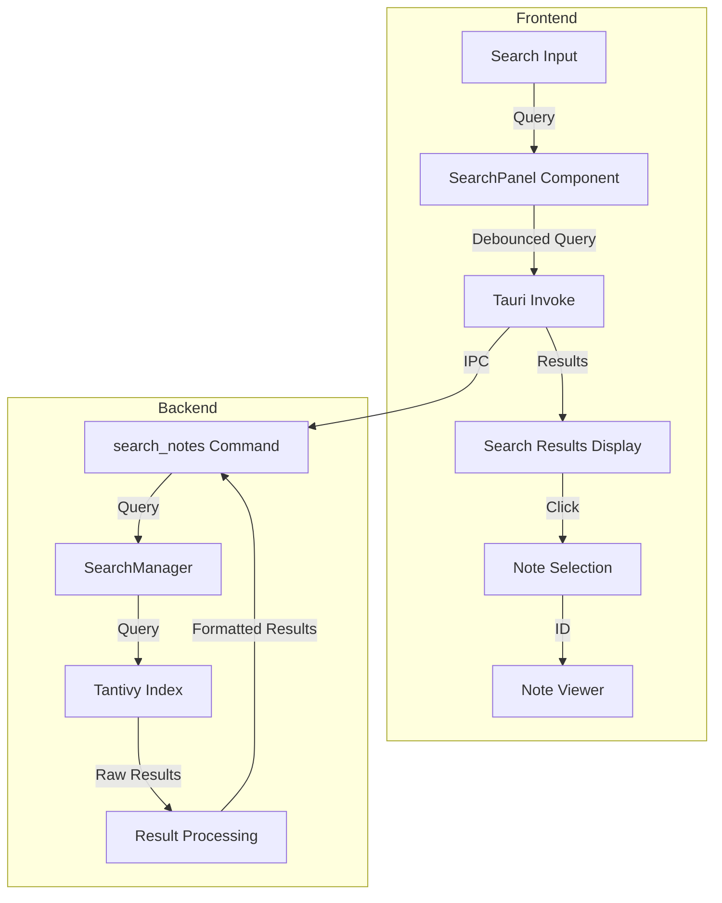
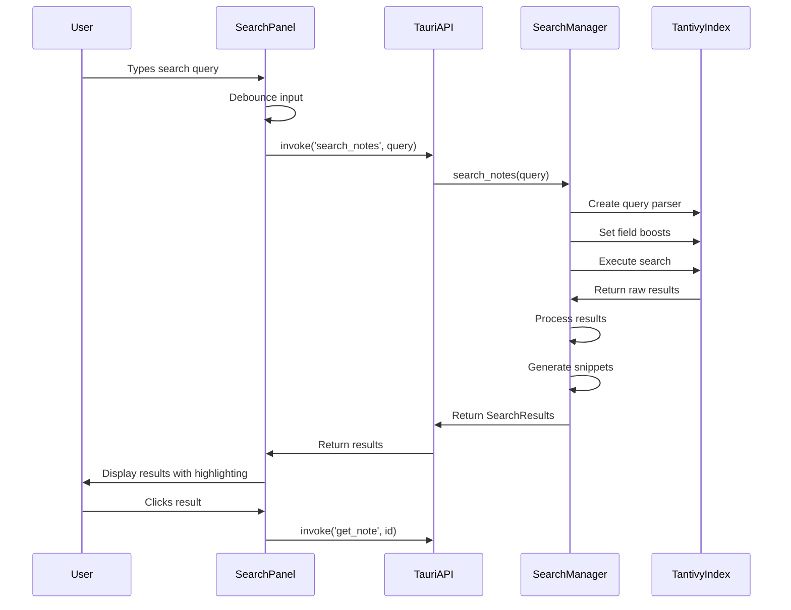
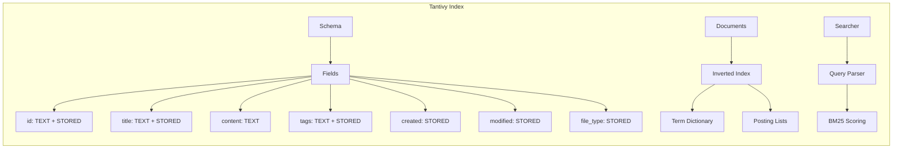
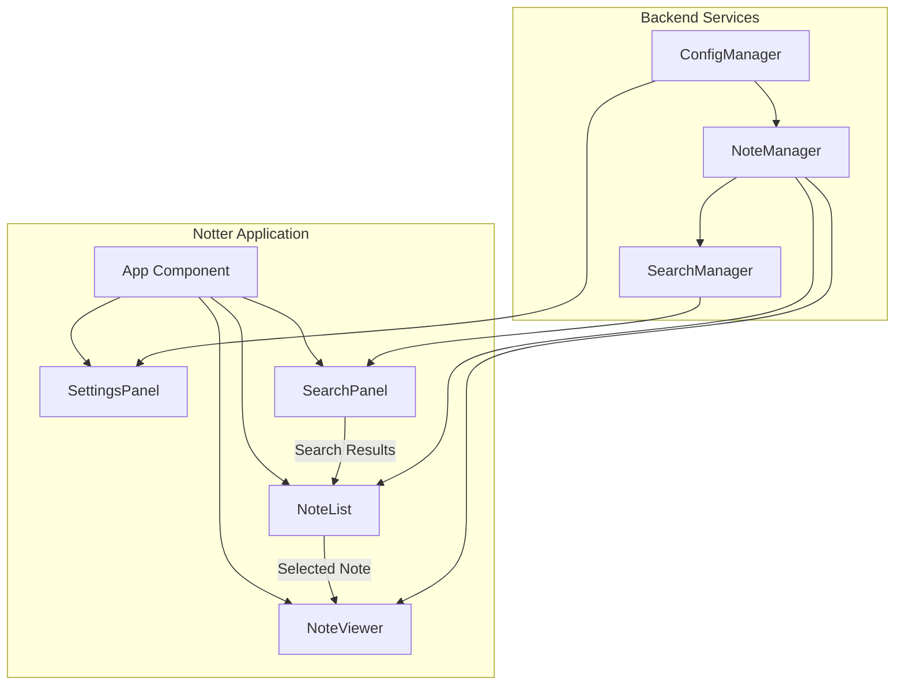

# Notter Search Architecture

This document provides visual representations of the search architecture in the Notter application.

## Search Component Architecture

## Search Data Flow

## Search Index Structure

## Integration with Application

